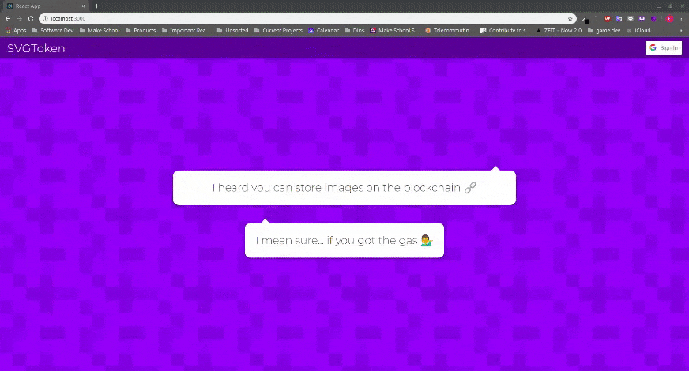

# SVGToken

An experiment into the feasibility of storing hash generated images on the blockchain. This project pushes some of the limits of a production level blockchain and so can currently be tested locally using Ganache. The client is a React SPA.

To view the initial proposal see [here](./proposal.md).

## Local Development

The client is located in the client folder and can be started from the _client_ folder using `npm i && npm start`.

The smart contract can be deployed on Ganache from the root of the repository using `npm i && npm run localdeploy`. Ensure `.env` file is present with variable `GANACHE_MNEMONIC` assigned a valid value (retreived from the Ganache GUI). You will have to raise the Gas Limit in Ganache to something like `100000000000` for transactions to be completed successfully.

## Demo

